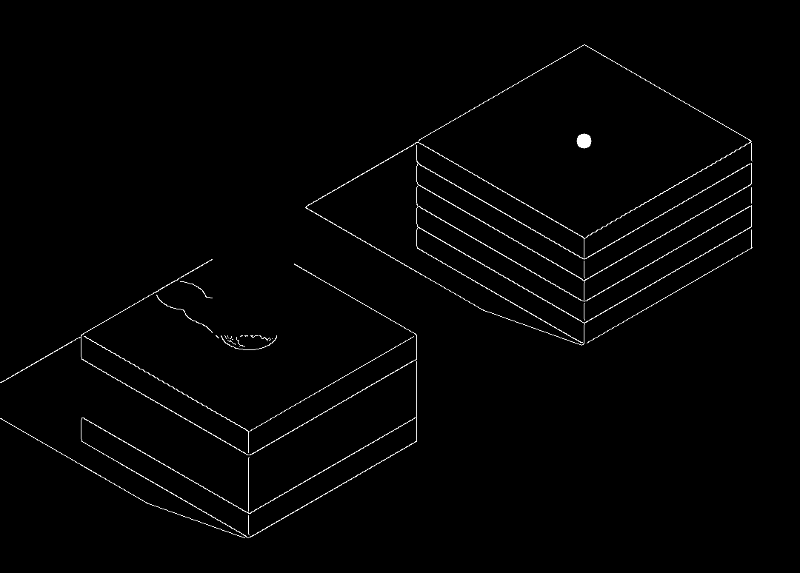

# Jump Jump Helper

## 项目名称

Jump_Jump_Helper

## 项目实现功能

“跳一跳”游戏辅助工具

本项目是一个辅助工具，旨在帮助用户在“跳一跳”游戏中获得更高的分数。通过获取手机屏幕截图，识别游戏界面中的起始位置和目标位置，计算合适的蓄力时间，并通过ADB控制手机进行跳跃，以达到游戏中跳跃到目标的目的。

* `assets/demo_video_mobile.mp4`
[移动端演示视频](assets/demo_video_mobile.mp4)

* `assets/demo_video_pc.mp4`
[电脑端演示视频](assets/demo_video_pc.mp4)

## 项目文件组成

* `main.py`
主程序

* `circle_template.jpg`
圆形中心点模板

* `player_template.jpg`
玩家模板

## 项目技术细节

### 导入模块

```python
import os
import cv2
import numpy as np
import time
import random
```

* `import os`
  `os` 模块用于执行操作系统相关的任务，特别是在与文件和目录相关的操作中。在这个项目中， `os` 模块主要用于执行与ADB相关的命令，如截取屏幕截图和拉取文件。

* `import cv2`
  `cv2` 模块是OpenCV库的Python接口，提供了丰富的图像处理功能。在这个项目中， `cv2` 被用来读取、处理和操作游戏屏幕截图，进行模板匹配、边缘检测等图像处理任务。

* `import numpy as np`
  `numpy` 是Python中用于科学计算的一个重要库，提供了高效的多维数组操作功能。在这个项目中， `numpy` 被用来进行数组操作，如计算距离、图像处理等。

* `import time`
  `time` 模块提供了与时间相关的功能，如获取当前时间、时间延迟等。在这个项目中， `time` 被用来控制蓄力时间和添加延迟等待，以模拟玩家的操作行为。

* `import random`
  `random` 模块提供了生成随机数的功能。在这个项目中， `random` 被用来生成随机的触摸位置，以模拟玩家的不确定性和变化性。

### 获取手机屏幕截图

> ADB（Android Debug Bridge）是一种用于在计算机和Android设备之间进行通信的命令行工具。它是 Android SDK（Software Development Kit，软件开发工具包）的一部分，提供了一系列命令，用于与连接到计算机的 Android 设备进行交互。
>
> ADB 可以执行各种任务，包括但不限于：
>
> * 在设备上安装和卸载应用程序。
> * 在设备上执行 shell 命令。
> * 拉取和推送文件到设备。
> * 获取设备的系统信息，如屏幕截图、设备状态等。
> * 模拟用户输入，如触摸、滑动等。
>
> 在开发过程中，开发人员经常使用 ADB 来调试和测试他们的应用程序，也可以用于自动化测试、设备管理等任务。在本例中，该工具用于获取游戏画面截图，并通过模拟触摸来控制游戏进程。

```python
def get_screenshot():
    """
    Get screen capture via Android Debug Bridge (ADB).
    """
    os.system('adb shell screencap -p /sdcard/screenshot.png')
    os.system('adb pull /sdcard/screenshot.png .')
```

在代码中，通过调用 `get_screenshot()` 函数，使用ADB命令来获取手机屏幕的截图，并将其保存到本地。具体实现是通过执行ADB命令 `adb shell screencap -p /sdcard/screenshot.png` 来在手机上进行截图，然后再通过 `adb pull /sdcard/screenshot.png .` 命令将截图文件拉取到本地。

### 确定起始位置与目标位置

#### 模板匹配

在确定起始位置和目标位置时，首先利用模板匹配的方法，通过预先准备好的玩家模板和圆形中心点模板，在截图中找到它们的位置。

```python
player_template = cv2.imread('player_template.jpg', 0)
circle_template = cv2.imread('circle_template.jpg', 0)
circle_template_width, circle_template_height = circle_template.shape[::-1]
```

通过 `cv2.imread` 函数加载玩家模板和圆形中心点模板图片，并获取模板图片的宽度和高度。

#### 边缘检测

当模板匹配的结果不够准确时，采用边缘检测的方法来确定目标位置。首先对截图进行高斯模糊处理，然后利用Canny边缘检测算法找到图像中的边缘。

```python
img_rgb = cv2.GaussianBlur(img_rgb, (5, 5), 0)
image_canny = cv2.Canny(img_rgb, 1, 10)
img_rgb, target_x, target_y = get_target_position(image_canny)
```

在 `get_target_position` 函数中，进一步处理边缘检测结果，确定目标位置的水平和垂直坐标。



#### 确定起始位置

在主循环中，首先获取当前截图，然后利用玩家模板进行匹配，找到玩家的起始位置。

```python
# Get screen capture via Android Debug Bridge (ADB)
get_screenshot()
img_rgb = cv2.imread('screenshot.png', 0)

# Match the starting position based on the template
_, _, _, player_pos = cv2.minMaxLoc(cv2.matchTemplate(img_rgb, player_template, cv2.TM_CCOEFF_NORMED))
start_pos = (player_pos[0] + 39, player_pos[1] + 189)
```

通过 `cv2.matchTemplate` 函数，在截图中匹配玩家模板，得到玩家的位置，并加上一个偏移量，确定起始位置。

#### 确定目标位置

在主循环中，根据模板匹配的结果或边缘检测的结果，确定目标位置。如果模板匹配的结果满足条件，即匹配值大于等于0.95，则直接使用模板匹配的结果作为目标位置；否则，采用边缘检测的方法确定目标位置。

```python
def get_target_position(image):
    """
    Retrieve the horizontal and vertical coordinates of the target position.
    """
    # Eliminate the influence of the player on edge detection
    for i in range(player_pos[1] - 10, player_pos[1] + 190):
        for j in range(player_pos[0] - 10, player_pos[0] + 100):
            image[i][j] = 0

    # Eliminate the influence of scores and buttons on edge detection
    image[0:530, :] = 0

    y_top = np.nonzero([max(row) for row in image[400:]])[0][0] + 400
    x_top = int(np.mean(np.nonzero(image[y_top])))
    y_bottom = y_top + 50

    for row in range(y_bottom, image.shape[0]):
        if image[row, x_top] != 0:
            y_bottom = row
            break

    return image, x_top, (y_top + y_bottom) // 2

while True:
    ...

    # Match the target position based on the template
    _, match_value, _, circle_pos = cv2.minMaxLoc(cv2.matchTemplate(img_rgb, circle_template, cv2.TM_CCOEFF_NORMED))

    # Edge detection will be used if the match value does not reach 0.95
    if match_value >= 0.95:
        print('Template matching')
        target_x, target_y = circle_pos[0] + circle_template_width // 2, circle_pos[1] + circle_template_height // 2
    else:
        print('Edge detection')
        ...

    ...
```

### 确定蓄力时间

根据起始位置和目标位置之间的距离，计算蓄力时间。蓄力时间与距离成正比关系，通过简单的线性关系进行计算，公式为：

```python
press_time = int(dist * 1.35)
```

### 控制手机进行蓄力

利用ADB命令控制手机进行跳跃操作。通过 `adb shell input swipe [press_x] [press_y] [press_x] [press_y] [press_time]` 命令，指定按压的起始坐标和结束坐标以及蓄力时间，实现手机屏幕的滑动操作，从而实现跳跃的效果。

```python
def jump(dist):
    """
    Perform one jump.
    """
    press_time = int(dist * 1.35)
    press_x = random.randint(-screen_width // 4, screen_width // 4) + screen_width // 2
    press_y = random.randint(-screen_height // 4, screen_height // 4) + screen_height // 2
    cmd = 'adb shell input swipe {} {} {} {} {}'.format(press_x, press_y, press_x, press_y, press_time)
    os.system(cmd)
    print(cmd)
```

该函数接受一个参数 `dist` ，即起始位置与目标位置之间的距离，然后根据一定的算法随机生成按压的位置，并利用ADB命令进行按压操作。

## 集成开发环境

* JetBrains PyCharm

## 文档更新日期

2024年3月12日